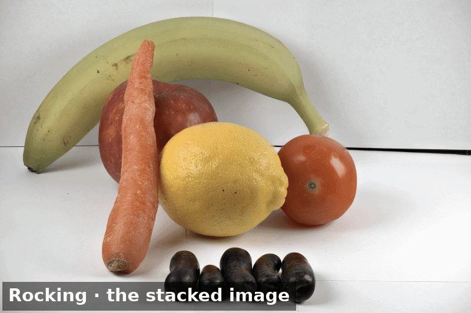
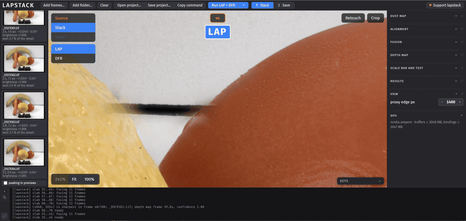
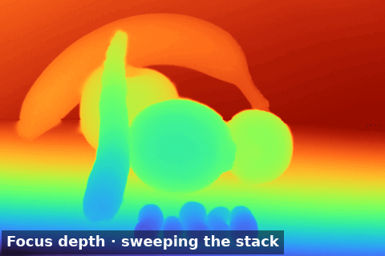
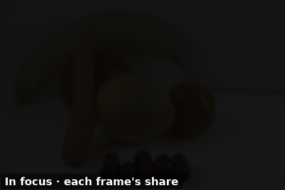
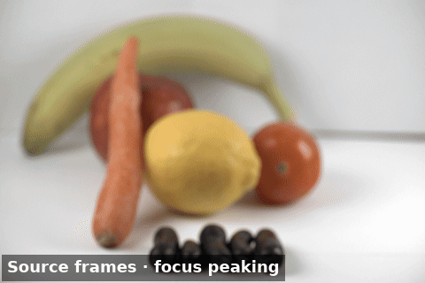

<h1 align="center">lapstack</h1>

<p align="center">
  <b>Focus stacking on the Laplacian pyramid, written from the papers — native, and in the browser on WebGPU.</b><br>
  A focus-bracketed series in, one all-in-focus image and a dense depth map out, with a retouch brush,<br>
  stereo pairs, rocking animations and a 3D model from the same run. Free software, offline, and yours.
</p>

<p align="center">
  
  
  
  <a href="https://github.com/ragtux/LAPSTACK/actions/workflows/ci.yml"></a>
</p>

<p align="center">
  <a href="https://lapstack.app.ragtux.com"><b>Run it in your browser</b></a> ·
  <a href="https://lapstack.ragtux.com/docs/">Manual</a> ·
  <a href="https://github.com/ragtux/LAPSTACK/releases">Releases</a> ·
  <a href="https://buy.stripe.com/5kQ8wQditbElbCugAp6wE00">Support lapstack</a>
</p>

<br>

<p align="center">
  
  <br>
  <sub>A 100-frame stack of 45 MP frames fused into one image, then rocked by its own depth map. Every animation on this page is one the browser app saved, reduced for the page.</sub>
</p>

> [!NOTE]
> **Nothing leaves your machine.** The browser app runs the whole engine on your own GPU through WebGPU; no frame is uploaded anywhere. The command-line tool and the desktop application run the same engine natively.

<p align="center">
  <a href="#features">Features</a> ·
  <a href="#everything-in-the-box">Everything in the box</a> ·
  <a href="#under-the-hood">Under the hood</a> ·
  <a href="#get-started">Get started</a> ·
  <a href="#downloads">Downloads</a> ·
  <a href="#documentation">Documentation</a> ·
  <a href="#license">License</a>
</p>

<br>

<table>
  <tr>
    <td width="25%" valign="top">
      <h3>📐 From the papers</h3>
      A from-scratch implementation of Burt &amp; Adelson's pyramid and the multifocus composite, with Wang &amp; Chang's region-energy selection. Every formula it implements is written down in <code>docs/</code>, deviations called out.
    </td>
    <td width="25%" valign="top">
      <h3>⚡ Native and fast</h3>
      One engine, three homes: CUDA, wgpu (Vulkan, Metal, DX12) and WebGPU run the same kernels. 100 frames of 45 MP align, fuse and get a depth map in 26 s on an RTX 3060, 85 s on the CPU.
    </td>
    <td width="25%" valign="top">
      <h3>🖌️ Retouch from thick slabs</h3>
      A side-by-side brush that paints from a source frame, a <b>slab</b> of the frames around it fused on their own, or the other stacked result; previewed under the cursor, undoable, replayed from the project file.
    </td>
    <td width="25%" valign="top">
      <h3>🗺️ Depth comes free</h3>
      Depth from focus with a confidence map, a depth-map rendering of the stack, synthetic stereo, rocking animations and a textured 3D model, all from the one run.
    </td>
  </tr>
</table>

<br>

## Features

<table>
  <tr>
    <td width="50%" valign="top">
      
      <br>
      <sub>A registration ghost on the chip's edge, painted over from a slab of eleven frames around the one that won that spot.</sub>
      <h3>Retouch without leaving the app</h3>
      <kbd>Ctrl</kbd>+<kbd>G</kbd> and a click jump to the frame the fusion found sharpest at that pixel. <kbd>R</kbd> opens a side-by-side compare with one zoom and pan: the stacked image on the left, the brush source on the right. <kbd>S</kbd> cycles the source between that frame, a <b>slab</b> (the frames around it fused on their own, so the brush copies a thick plane of focus instead of one frame's sliver) and the other stacked result. The brush shows the dab it would lay down before the button goes down; <kbd>Alt</kbd>+wheel sets its size, <kbd>Alt</kbd>+<kbd>Shift</kbd>+wheel its hardness, <kbd>Ctrl</kbd>+<kbd>Z</kbd> takes a stroke back. Strokes go to the 16-bit master, and the project file replays them pixel for pixel.
    </td>
    <td width="50%" valign="top">
      
      <br>
      <sub>The depth map in Turbo, a slice sweeping through the frames.</sub>
      <h3>A depth map worth keeping</h3>
      Depth from focus on every frame's focus measure, aggregated by a guided filter, with sub-frame peaks and a confidence-weighted, edge-aware smoothing solve. The map is a layer of the viewer (gray or Turbo, with a sweeping slice), a 16-bit file with a fixed scale, the guide for <b>DFR</b>, a second rendering of the stack that blends the frames by depth instead of picking pyramid coefficients, and the relief of the stereo pair, the rocking animation and the 3D model.
    </td>
  </tr>
  <tr>
    <td width="50%" valign="top">
      
      <br>
      <sub>In focus: what each frame contributes to the result, lit up frame by frame.</sub>
      <h3>See what every frame is for</h3>
      The <b>In focus</b> layer shows each frame's own pixels where the result uses them, so a frame that contributes nothing is obvious. Every run logs each frame's share of the detail, the filmstrip prints it under the thumbnail, and <b>cull</b> (the CLI's <code>--cull</code>) drops the near-duplicates and the frames focused on empty space before the next run.
    </td>
    <td width="50%" valign="top">
      
      <br>
      <sub>The aligned source frames under their focus-peaking band.</sub>
      <h3>Alignment you can inspect</h3>
      A similarity, affine or projective registration found on the pyramid, chained frame to frame back to the first, with the shift, scale and rotation printed under every thumbnail. The <b>Source</b> layer scrubs the aligned frames with focus peaking over them; the frames are resampled once, with the kernel you choose, and the output is cropped to the area every frame covers.
    </td>
  </tr>
</table>

<br>

## Everything in the box

<table>
  <tr>
    <td width="33%" valign="top">
      <h4>📥 Inputs</h4>
      PNG, JPEG and TIFF at 8 or 16 bits, and camera raws (NEF, CR2/CR3, ARW, DNG, RAF, ORF, RW2, PEF, …) developed as shot. A raw stack can come out as a <b>linear DNG</b> in the camera's own color space, so a raw converter develops the stacked image like a raw, highlights past white and all. A dust map shot out of focus takes the sensor's dust out of every frame first.
    </td>
    <td width="33%" valign="top">
      <h4>🧭 Alignment</h4>
      Shift, scale and rotation, or affine, or projective for a camera that tilted as it stepped; coarsened for speed; the search on the GPU if you like. Brightness equalized to the first frame, frames turned for a camera held sideways, the result cropped to the common area or stretched back to the frame's size. Six resampling kernels, from nearest to Lanczos.
    </td>
    <td width="33%" valign="top">
      <h4>🧩 Fusion</h4>
      The Laplacian pyramid with maximum region energy per band and a deviation-and-entropy rule at the residual; <b>halo control</b> for the bright object that bleeds into its neighbor; <b>DFR</b>, the depth-map rendering; <b>WAV</b>, a seamless weighted average that follows the fused image's edges; and <b>slabs</b>, thick planes of focus fused on their own to retouch from.
    </td>
  </tr>
  <tr>
    <td width="33%" valign="top">
      <h4>📤 Outputs</h4>
      The stacked image at the input bit depth, carrying the first frame's EXIF, ICC profile and XMP. The depth map at 8 or 16 bits, the confidence map, the winner map. A stereo pair (side by side, crossed or anaglyph), a rocking animation (frames, or an MP4), a 3D model as GLB, OBJ or STL textured with the result. In the browser also GIF, MP4 and WebM animations, and content credentials signed into the file.
    </td>
    <td width="33%" valign="top">
      <h4>🔬 Microscopy</h4>
      A scale bar calibrated from the frames' own metadata (ImageJ, OME-TIFF, a scanner's resolution) or a figure you give, with a caption that can carry the capture date, the frame count and the stack's number, burned into the image and the animations in the corner and style you pick.
    </td>
    <td width="33%" valign="top">
      <h4>🔁 Workflow</h4>
      Batch runs that cut a folder into stacks by count, by pauses in the capture times or by folder; <b>tethered</b> capture, where the tool watches a folder and stacks each series as it settles; draft runs at a quarter of the size to check settings; project files that carry the frames, every setting and the retouch strokes, and run on the CLI with <code>--config</code>; a <b>Copy command</b> button that turns the app's settings into the command line; a Lightroom Classic plugin; a desktop application.
    </td>
  </tr>
</table>

<br>

## Under the hood

- **One core, three engines:** `lapstack-core` holds the pyramid, the aligner, the depth pass and every output. The CUDA engine and the wgpu engine run the same kernels natively; the browser runs the wgpu kernels on WebGPU, one frame at a time in a Web Worker, so browser memory stays at a couple of frames regardless of stack size.
- **Streaming by design:** a 100-frame stack of 45 MP frames never sits in memory whole. Frames stream from disk, the fold keeps one accumulator, and a pooling allocator recycles the big planes; the CPU run peaks at 12 GB, the CUDA run at 9.4 GB.
- **From scratch:** written from the papers cited in [`docs/README.md`](docs/README.md), with no reference to anyone else's source. The design document in [`docs/engine.md`](docs/engine.md) and [`docs/browser.md`](docs/browser.md) states every formula and names the file that implements it.
- **The raw decoder kept apart:** the camera raw decoder (rawler, LGPL) is a module of its own, loaded at run time by the CLI and as a separate wasm module by the browser, so the MIT-licensed engine never links it and you can replace it.
- **Checked against itself:** the browser's fused image, depth map and confidence match the native run's to the quantization; the wgpu and CUDA aligners land on the CPU's registration within the search's own tolerance; a headless Chrome test runs the browser end to end on a GPU.

```
crates/lapstack-core   library: pyramid, fusion, depth from focus, aligner, dust map, stereo views, 3D model, batch splitting, I/O, linear DNG, frame preparation
crates/lapstack-cli    `lapstack` command-line tool
crates/lapstack-web    the browser app's engine: wasm32 decode + the core's wgpu kernels on WebGPU
crates/lapstack-raw    the camera raw decoder (rawler, LGPL) as a module of its own: a shared library the CLI loads at run time, a wasm module the browser app loads beside its engine
web/                   the browser app (static files) and its headless test
docs/                  the design document (`engine.md`, `browser.md`) and the papers the algorithm is written from, cited
lightroom/             the Lightroom Classic plugin (the CLI as an export target and a Library menu item)
desktop/               the browser app as an Electron desktop application
```

## Get started

**In the browser**, nothing to install: open [lapstack.app.ragtux.com](https://lapstack.app.ragtux.com), add the frames, press *Run*. Chrome and Edge have WebGPU on by default on Windows and macOS; on Linux, Chrome needs the switches in `web/chrome.sh` (or use the desktop application); Firefox needs `dom.webgpu.enabled`; Safari 26 and later work.

**The command-line tool**, from a [release](https://github.com/ragtux/LAPSTACK/releases) or from source:

```sh
cargo build --release                                              # the CLI and the raw decoder module, in target/release
lapstack --align-coarsen 2 --save-depth -o out.png frames/*.tif    # align, fuse, write the depth map beside the result
lapstack --no-align -o out.png aligned/*.png                       # already registered: streams from disk
lapstack --gpu --gpu-align --align-coarsen 2 -o out.png frames/*.tif   # fusion, depth pass and the aligner's search on the GPU
lapstack --help                                                    # every option, with its default
```

A directory stands for the image files in it. Input is PNG, JPEG or TIFF, 8- or 16-bit, or a camera raw; the output keeps the input bit depth (16-bit needs PNG or TIFF) and carries the first frame's EXIF, ICC profile and XMP (`--no-metadata` turns it off).

**From source, the rest:** `just` lists the developer commands (build, test, serve, chrome, dev, …); `just build-web && just serve` builds the browser app and serves it on http://localhost:8765/; `CONTRIBUTING.md` is the short version.

### GPU builds

Two engines, two build features, one switch: `--gpu` fuses (and runs the
depth pass) on the GPU, `--gpu-align` puts the aligner's cost search there
too, and `--gpu-backend cuda | wgpu` names the engine — without it the first
that answers is taken, CUDA before wgpu, and a run with neither says so and
goes on on the CPU.

```
cargo build --release --features gpu,wgpu -p lapstack-cli
# CUDA (`gpu`; `gpu.rs`): NVIDIA. Linux: libcuda (driver) + libnvrtc (toolkit) on the path,
#   and nvidia_uvm loaded. NixOS: LD_LIBRARY_PATH=/run/opengl-driver/lib:<cudaPackages.cuda_nvrtc's lib output>/lib
#   Windows: nvcuda.dll ships with the display driver; drop the two DLLs from NVIDIA's cuda_nvrtc
#   redist zip (bin/nvrtc64_120_0.dll + nvrtc-builtins) next to lapstack.exe, their major.minor
#   matching the driver's CUDA version (nvidia-smi), or the PTX JIT rejects the kernels.
# wgpu (`wgpu`; `wg/`): any GPU — Vulkan on Linux and Windows, Metal on macOS, DX12 on Windows.
#   Linux needs the Vulkan loader (libvulkan.so.1) and the driver's ICD; NixOS:
#   LD_LIBRARY_PATH=<vulkan-loader's lib>:/run/opengl-driver/lib and, with several ICDs installed,
#   VK_ICD_FILENAMES=/run/opengl-driver/share/vulkan/icd.d/nvidia_icd.json (or the one for the card).
```

`cudarc` is built with `dynamic-loading` and wgpu finds its backends at run
time, so a binary built with both features runs on a machine with neither:
`--gpu` reports what it looked for and the CPU does the work.

## Downloads

Builds for Linux, Windows and macOS are attached to each [release](https://github.com/ragtux/LAPSTACK/releases); the browser app needs no download. The desktop builds are not code signed, so Windows and macOS warn before the first launch.

### Command-line tool

Each archive holds the binary, the raw decoder module beside it, `LICENSE`, `THIRD-PARTY.md` and the decoder's source.

| Platform | File | GPU engines in the build |
|---|---|---|
| Linux x86_64 | `lapstack-<ver>-x86_64-unknown-linux-gnu.tar.gz` | CUDA and wgpu (Vulkan) |
| Windows x64 | `lapstack-<ver>-x86_64-pc-windows-msvc.zip` | CUDA and wgpu (Vulkan, DX12) |
| macOS, Apple silicon | `lapstack-<ver>-aarch64-apple-darwin.tar.gz` | wgpu (Metal) |
| macOS, Intel | `lapstack-<ver>-x86_64-apple-darwin.tar.gz` | wgpu (Metal) |

### Desktop application

The browser app in an Electron window, with WebGPU on every platform and no launcher script.

| Platform | Files |
|---|---|
| Linux | `lapstack-<ver>.AppImage`, `lapstack-desktop_<ver>_amd64.deb` |
| Windows | NSIS installer (`.exe`) |
| macOS | `.dmg`, x64 and arm64 |

### Lightroom Classic plugin

`lapstack-lightroom-<ver>.zip` holds `lapstack.lrplugin`: add it in File › Plug-in Manager, point it at the `lapstack` binary, then select the frames of a stack and choose Library › Plug-in Extras › **Stack with lapstack**, or export with lapstack as the *Export To* target. The result comes back into the catalog stacked above the first frame. [`lightroom/README.md`](lightroom/README.md) has the settings and the details; [`desktop/README.md`](desktop/README.md) the desktop application's.

## Documentation

- The **manual**, for users: [lapstack.ragtux.com/docs](https://lapstack.ragtux.com/docs/).
- The **design document**, for anyone reading or changing the code: [`docs/engine.md`](docs/engine.md) (the engine and the command-line tool: transform, fusion, alignment, depth from focus, the raw and DNG paths, dust map, scale bar, stereo and 3D model, batch runs, performance, the wgpu engine) and [`docs/browser.md`](docs/browser.md) (the browser app: every layer and render, retouch, results and project files, the GPU aligner).
- The **papers** the algorithm is written from: [`docs/README.md`](docs/README.md).
- [`CONTRIBUTING.md`](CONTRIBUTING.md) for bug reports and changes, [`SECURITY.md`](SECURITY.md) for a security problem (security@ragtux.com).

lapstack is made by RAGTUX LLC. A [contribution](https://buy.stripe.com/5kQ8wQditbElbCugAp6wE00) helps keep it going and buys nothing, because nothing is for sale.

## License

lapstack is free software under the MIT license: Copyright (c) 2026 RAGTUX
LLC, `LICENSE` is the whole of it (SPDX `MIT`), and it covers the source in
this repository and everything built from it — the command-line tool, the
browser application, the desktop application and the Lightroom Classic
plug-in. Earlier revisions were published under other terms (AGPL-3.0-only
from 2026-09-24 to 2026-09-30, then a proprietary license); those terms stay
with the copies distributed under them and do not extend to this revision.
Paying for lapstack, where it is offered, buys support and services, not the
software: the software is yours.

Third-party components keep their own licenses and are listed with their
notices in `THIRD-PARTY.md`, which `just third-party` regenerates from the
Cargo metadata and the crates' own license files; a distributed build carries
it. Two need more than a listing:

- The camera raw decoder is LGPL-2.1: `vendor/rawler` (MIT and LGPL-2.1 per
  file, copyright Daniel Vogelbacher) inside `crates/lapstack-raw`, RAGTUX's
  own LGPL-2.1 shim around it. It is kept a component of its own so that
  the MIT-licensed parts and the LGPL work stay separate and the user can
  replace it, as the LGPL asks, so lapstack never links it: `lapstack-raw`
  is built as a shared library the CLI loads at run time and as a wasm
  module the browser app loads beside its engine, and its
  source — the crate and the patched rawler, with a workspace file so it
  builds as it is — travels with every build (`web/dist.sh` puts
  `legal/lapstack-raw-src.tar.gz` in the app; the CLI's downloads carry the
  same tarball). `vendor/rawler/LAPSTACK-PATCH.md` has the obligations in
  full; `crates/lapstack-raw/README.md` how to rebuild and drop in a
  replacement.
- The papers the algorithm is written from are cited in `docs/README.md`
  rather than redistributed: they are their authors' and publishers' work,
  under their own copyright.
